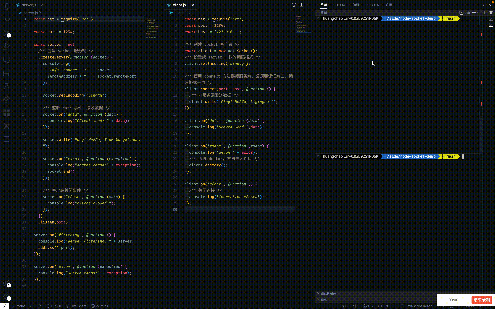

# Nodejs Socket demo

Node.js socket 其实非常简单，只需要用 `net.createServer` 即可创建一个 Socket 服务端，并开始监听。只需要短短几十行代码，即可实现socket的连接。



**server.js**

```js 
const net = require("net");

const port = 1234;

const server = net
  /** 创建 socket 服务端 */
  .createServer(function (socket) {
    console.log(
      "Info: connect -> " + socket.remoteAddress + ":" + socket.remotePort
    );

    socket.setEncoding("binary");

    /** 监听 data 事件，接收数据 */
    socket.on("data", function (data) {
      console.log("Client send: " + data);
    });

    socket.write("Pong! Hello, I am Wangxiaobo.");

    socket.on("error", function (exception) {
      console.log("socket error:" + exception);
      socket.end();
    });

    /** 客户端关闭事件 */
    socket.on("close", function (data) {
      console.log("client closed!");
    });
  })
  .listen(port);

server.on("listening", function () {
  console.log("server listening: " + server.address().port);
});

server.on("error", function (exception) {
  console.log("server error:" + exception);
});
```

**client.js**
```js
const net = require('net');
const port = 1234;
const host = '127.0.0.1';

/** 创建 socket 客户端 */
const client = new net.Socket();
/** 设置成 server 一致的编码格式 */
client.setEncoding('binary');

/** 使用 connect 方法链接服务端，必须要保证端口、编码格式一致 */
client.connect(port, host, function () {
  /** 向服务端发送数据 */
  client.write('Ping! Hello, Liyinghe.');
});

client.on('data', function (data) {
  console.log('Server send:',data);
});

client.on('error', function (error) {
  console.log('error:' + error);
  /** 通过 destory 方法关闭连接 */
  client.destory();
});

client.on('close', function () {
  /** 关闭连接 */
  console.log('Connection closed');
});

```
